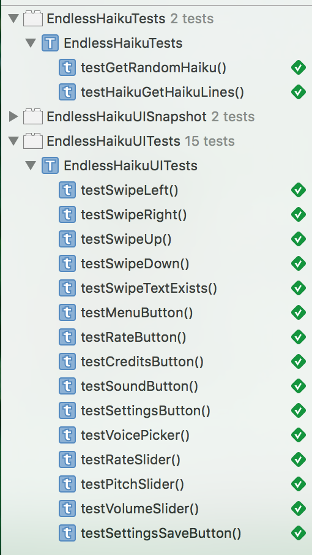

Endless Haiku
===============

Background
----------
"Old dark sleepy pool...
Quick unexpected frog,
Goes plop! Water splash!"

One of many famous haikus from the great haiku master Basho. This app contains over 200 haikus gather from the greatest haiku masters of Japan.

Read, listen, and understand the natural world around us from these thoughtful haikus. 

You can share haikus with family and friends through Facebook and Twitter. You can also change the speaking voice to your liking. 

Get this app and enjoy an endless stream of haikus whenever, wherever you go!

Available on the App Store: [link](https://itunes.apple.com/us/app/endless-haiku/id1085414045?ls=1&mt=8) 

Demo
----

Test results
------------
<h3 align="left">

</h3>